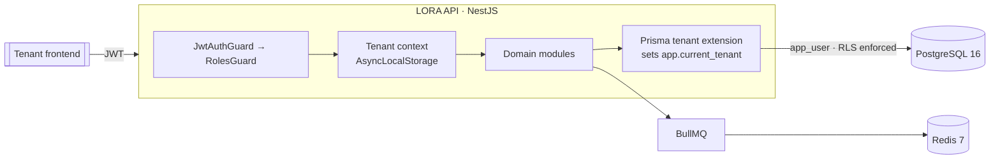

# LORA API

White-label, multi-tenant booking platform for med spas — built API-first.

LORA lets each spa run its own branded booking experience on top of a shared,
strongly-isolated backend. The platform charges a flat subscription and takes
**0% of bookings** — tenants keep 100% of their revenue.

> **Status:** Phase 0 — multi-tenant API foundation. See [Roadmap](#roadmap).

---

## Highlights

- **Modular monolith** on [NestJS 11](https://nestjs.com/) — clean module
  boundaries, ready to peel into services later if ever needed.
- **Defense-in-depth multi-tenancy.** Every tenant-owned row is isolated at
  **two** layers: an application-level Prisma query extension *and* PostgreSQL
  **Row-Level Security** enforced against a non-privileged database role.
- **Supabase-compatible auth.** Stateless HS256 JWTs verified with
  [`jose`](https://github.com/panva/jose); role-based access control via guards.
- **Typed, generated API contract.** Swagger/OpenAPI is the source of truth for
  the forthcoming `@lora/sdk` client.
- **Production-minded defaults.** Helmet, CORS allowlist, structured
  request-scoped logging (pino) with correlation IDs, rate limiting, graceful
  shutdown, health checks, and a consistent error envelope.

## Tech stack

| Concern          | Choice                                             |
| ---------------- | -------------------------------------------------- |
| Runtime          | Node.js ≥ 20                                        |
| Framework        | NestJS 11                                           |
| ORM / DB         | Prisma 6 · PostgreSQL 16                            |
| Cache / queues   | Redis 7 · BullMQ                                    |
| Auth             | Supabase-style JWT (`jose`)                         |
| Logging          | `nestjs-pino`                                       |
| API docs         | `@nestjs/swagger` (OpenAPI 3)                       |
| Tests            | Jest (unit + e2e, incl. tenant-isolation suite)    |
| Package manager  | pnpm                                               |

## Architecture



Every request flows: **authenticate → resolve tenant context → scope all
queries**. The Prisma extension wraps each query in a transaction that sets the
`app.current_tenant` GUC, and Postgres RLS policies (`FORCE`d, evaluated as the
`app_user` role) guarantee a tenant can never read another tenant's rows — even
if application code has a bug.

## Getting started

### Prerequisites

- Node.js ≥ 20 and [pnpm](https://pnpm.io/)
- [Docker Desktop](https://www.docker.com/products/docker-desktop/) (for local
  Postgres + Redis)

### Setup

```powershell
# 1. Install dependencies
pnpm install

# 2. Create your local env file
Copy-Item .env.example .env   # macOS/Linux: cp .env.example .env

# 3. Start Postgres + Redis
docker compose up -d

# 4. Apply migrations (schema + RLS) and seed two demo tenants
pnpm prisma:deploy
pnpm db:seed

# 5. Run the API (watch mode)
pnpm start:dev
```

The API listens on `http://localhost:3000`:

- `GET /` — service info
- `GET /health` — liveness + DB/Redis readiness
- `GET /docs` — Swagger UI
- `GET /v1/*` — versioned application endpoints

### Minting a dev token

Endpoints under `/v1` require a bearer token. Mint one for a seeded user:

```powershell
pnpm -s exec tsx --env-file=.env scripts/dev-token.ts ownerA
```

## Available scripts

| Script                 | Description                                          |
| ---------------------- | ---------------------------------------------------- |
| `pnpm start:dev`       | Run with file watching                               |
| `pnpm start:prod`      | Run the compiled build (`dist/src/main`)             |
| `pnpm build`           | Compile with the Nest CLI                            |
| `pnpm typecheck`       | `tsc --noEmit`                                        |
| `pnpm lint`            | ESLint (autofix)                                      |
| `pnpm test`            | Unit tests                                            |
| `pnpm test:e2e`        | e2e tests incl. **tenant-isolation** suite            |
| `pnpm prisma:migrate`  | Create/apply a dev migration                          |
| `pnpm prisma:deploy`   | Apply migrations (CI/prod)                             |
| `pnpm db:seed`         | Seed demo tenants                                     |
| `pnpm db:reset`        | Drop, re-migrate, and re-seed                         |
| `pnpm openapi:export`  | Build and emit `openapi.json`                         |

## Project structure

```
src/
  common/        cross-cutting: auth, tenancy, prisma, logging, filters, dto
  config/        env validation (zod) + typed config service
  modules/       domain modules (auth, stores, staff, services, bookings, …)
  health/        liveness/readiness indicators
  queues/        BullMQ registration
  setup-app.ts   shared HTTP setup (used by main.ts and e2e tests)
  main.ts        bootstrap
prisma/
  schema.prisma  data model
  migrations/    SQL incl. RLS + app_user role
  seed.ts        idempotent demo data (two tenants)
scripts/         dev token + OpenAPI export
test/            unit + e2e (incl. isolation.e2e-spec.ts)
```

## Security model

- **Two database roles.** The app connects as `app_user`
  (`NOBYPASSRLS`); migrations and seeding use a superuser via `DIRECT_URL`.
- **RLS fails closed.** Policies use
  `NULLIF(current_setting('app.current_tenant', true), '')::uuid`, so a missing
  tenant context yields **zero rows** rather than leaking data.
- **Secrets stay out of git.** `.env` is ignored; `.env.example` ships only
  local throwaway values.
- Cross-tenant access returns `404` (never confirming another tenant's
  resources exist).

## Testing

```powershell
pnpm test       # unit
pnpm test:e2e   # e2e, including dual-layer tenant isolation
```

The isolation suite proves a tenant cannot read another tenant's data at **both**
the application layer (via the HTTP API) and the database layer (querying
directly as `app_user`).

## Roadmap

- **Phase 0 — API foundation** *(current)*: multi-tenancy, auth/RBAC, RLS,
  health, queues, OpenAPI, isolation tests.
- **Phase 1+**: bookings & availability, payments (Stripe), theming, loyalty,
  notifications, the `@lora/sdk` client, and the tenant/admin UIs.

## License

UNLICENSED — proprietary. All rights reserved.
